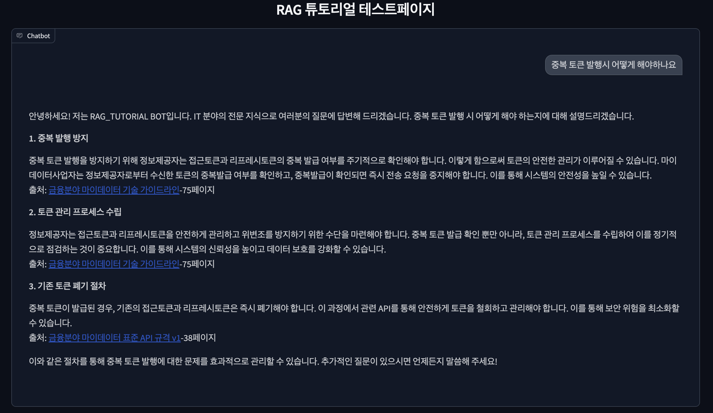
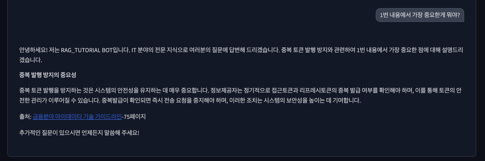

# RAG TUTORIAL - CUSTOM CHAIN TEST
- GRADIO+FASTAPI를 통한 기본적인 챗봇+API 개발
- 개발 환경
  - version : python3.10
  - os : mac, ubuntu
  - framework : langchain
  - vectorstore : chromadb
  - serving : fastapi
  - chat_framework : gradio 
- 튜토리얼에 활용한 문서
  - (221115 수정배포) (2022.10) 금융분야 마이데이터 기술 가이드라인.pdf
  - (수정게시) 금융분야 마이데이터 표준 API 규격 v1.pdf
- 방식
  - chromadb를 활용하여 Vectorstore 구축
  - RetrievalQAWithSourcesChain 기반으로 나만의 custom chain 구축
    - 입력 카테고리에 따른 별도 문서 검색
  - memory를 활용하여 멀티턴 대화형 챗봇(현재 버전에서 memory를 사용했으나 gradio의 history기능만 활용)
    - chain.invoke에 chat_history로 memory.chat_memory.messages 전달시 활용가능
  

### 1. DIR 구조
- /
  - requirements_required.txt # 실제로 설치 진행한 library 정보
  - requirements_full.txt # 설치된 full library 정보
  - sample_embedding_env # embedding 시 필요한 environment 값<br>(OPENAI_API_KEY 업데이트 후 embedding_env 로 변경 필요)
  - sample_api_env # api 실행시 필요한 environment 값<br>(OPENAI_API_KEY 업데이트 후 embedding_env 로 변경 필요)
  - main.py          # 챗봇 실행 코드
  - embeddings.py    # 데이터 embedding 코드
  - preprocessing.py # PDF파일 전처리 코드
  - data
    - documents # 원본 PDF파일
    - pre_documents # 전처리된 XLSX 파일
    - document_info.py # 임베딩 시 필요한 metadata 및 전처리 정보 코드
  - model
    - rag.py # CUSTOM CHAIN 구축 코드
  - packages # https://github.com/lsjsj92/fast-api-tutorial 코드 활용
    - routers
      - api_only_router.py # API만 있는 기능 구현 중
      - api_with_test_page.py # API+GRADIO 코드
    - __init__.py
    - config.py # 기본적인 config 코드
    - handle.py # API config data type 체크 코드
    - runner.py # uvicorn 실행 코드

### 2. 코드 실행
- Library 설치
  ```bash
  python3 -m pip install -r requirements_required.txt
  # preporcessing진행시 pdf2image 추가적으로 필요
  ```
- EMBEDDING 코드 실행
  ```bash
  # 원본 문서들로 임베딩 진행
  python3 embeddings.py
  # 전처리된 문서들로 임베딩 진행
  python3 embeddings.py --p
  ```
- GRADIO+API 코드 실행
  ```bash
  # port 변경 원할 시 packages/config.py VariableConfig 설정
  # 추후 --mode 로 api_only 모드, api_with_testpage 모드 구분 
  python3 main.py --host 0.0.0.0 --port 8000 
  ```
  
### 3. 전처리
- 기본 splitter 로 구분 시 많은 표를 정확한 정보로 활용하는것이 제한
- pdfplumber를 통해 documents의 text를 추출하여 gpt-4o에게 markdown 추출 요구 시 생각보다 미흡하게 추론
- pdf를 이미지로 분할하여 gpt-4o에게 전달하여 markdown형식으로 구조화하는게 text를 변환하는 것보다 원문에 가까움
- gpt-4o를 통해 pdf 2개에 대하여 이미지 500장 가까이 추론하여 3달러 정도 소요
- 이후 gpt-4o가 직접적으로 못한 내용을 눈으로 확인하며 데이터 보정
- 출처를 명확하게 표기하기 위해 page_content와 page 일치화
  - 추가적으로 source 표기시 [파일이름] (URL)-{page}페이지 정리


### 4. 테스트
- 1차 질문
  
- 2차 질문
  
### 5. 추후고도화 작업
- API, API+Gradio 모드로 분리
- 답변 고도화
- 문서 전처리 완료
- API상에서 세션별 멀티턴 기능 추가

